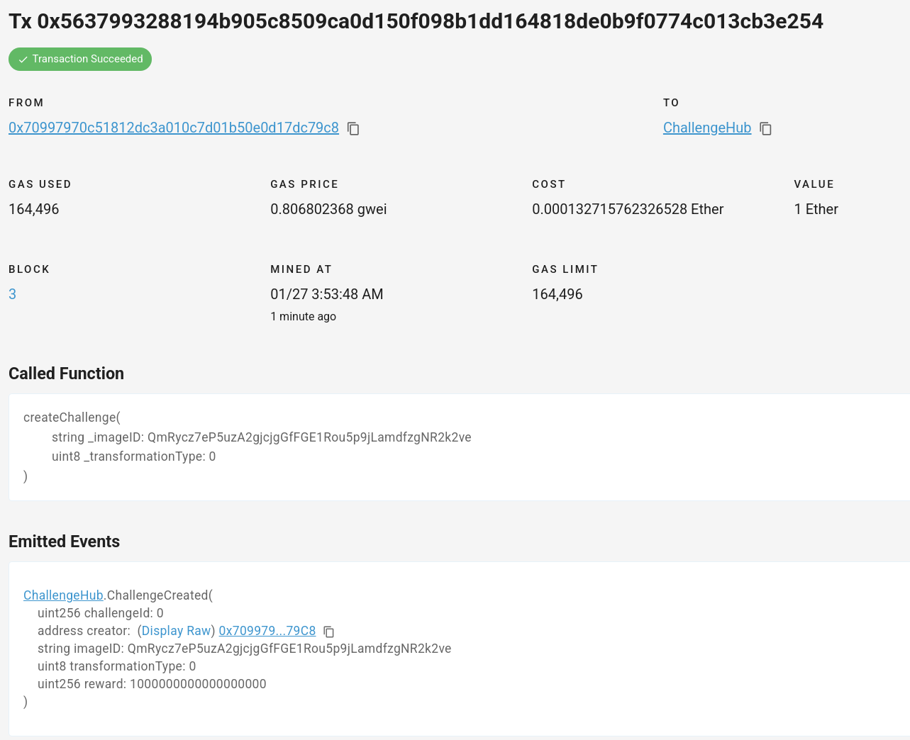
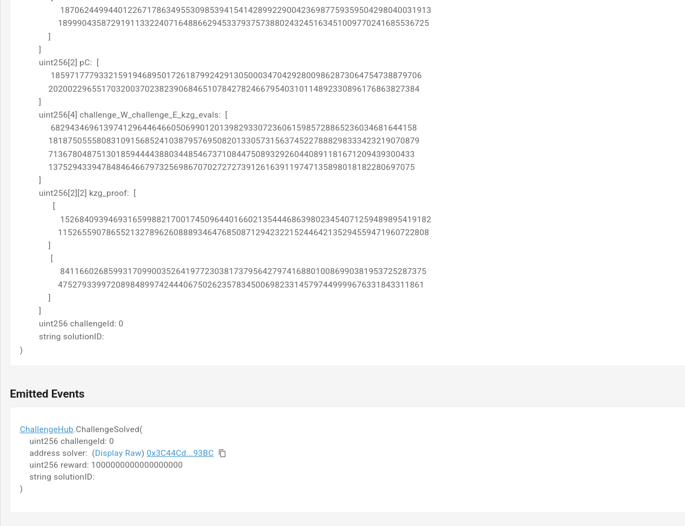

# Proof of Provenance: on-chain verification

## Summary

This is a demonstration of how VIMz tool can be used to generate ZK proofs for image manipulation, that can be further verified on-chain, thanks to the integration with Sonobe library.
The showcase scenario has two main actors: the challenger and the solver.
The challenger creates a challenge by publishing an image to IPFS and demanding a certain transformation to be done to it.
For a correct solution, the solver will be granted a reward.
The whole challenge is implemented as a smart contract on the distributed ledger (EVM-based chain).
The solver fetches the source image, edits it, and generates a ZK proof of the transformation validity with VIMz tool.
The proof is then submitted to the smart contract, which verifies it on-chain.

## Technical details

### Contracts

#### Challenge hub

The main contract is [`ChallengeHub.sol`](ChallengeHub.sol).
It serves as a registry and host for all challenges.
Challenge creator can create a new challenge by calling `createChallenge` function, passing there ID of the source image (e.g., an IPFS item identifier), proposed reward and the desired transformation to be applied.
Once a challenge is published, anyone can submit a solution by calling `submitSolution` function.
Submission must contain the id of the challenge, the ID of the solution image, and the ZK proof of the transformation validity.
The proof is verified on-chain using appropriate verifier contract (see below).

#### Verifier contracts

For every transformation type, there is a separate verifier contract generated by Sonobe library.
Source codes can be found in the [`verifier-contracts`](verifier-contracts/) directory.

### Image registry

Since the images might be too large to be passed as a calldata to a smart contract or stored on-chain, we must use some kind of off-chain storage.
One can use any data availability layer, like IPFS, Swarm, or any other decentralized storage.
In this scenario, we use local IPFS node to store the images.

### Off-chain tools

The only off-chain components are: an image editor (in our case, a simple Python script) and VIMz tool for generating ZK proofs, compatible with Sonobe verifiers.
All transformations were implemented as circuits in the [`circuits`](../circuits/sonobe) directory in Circom language.

## Requirements

1. You must be able to run VIMz tool together with its dependencies (like `Rust`, `Python3`, `Circom`, `Node`).
2. Foundry (https://book.getfoundry.sh/getting-started/installation).
3. IPFS (https://docs.ipfs.tech/install/command-line/).
4. Auxiliary tools like `jq`, `xxd`, `cut`.

You can check if you have all the necessary tools by running the following command:

```bash
./check-env.sh
```

In case you are missing some tools, the script will print out the instructions on how to install them.


## Running the scenario

After running `./scenario.sh`, you should see output similar to the following:

```
✅ Checking requirements and installing dependencies
✅ Anvil node started
✅ Contracts deployed
🚀 Creating challenge
  ✅ Challenge uploaded to IPFS with ID: QmRycz7eP5uzA2gjcjgGfFGE1Rou5p9jLamdfzgNR2k2ve
  ✅ Challenge created
🚀 Solving challenge
  ✅ Found challenge ID: QmRycz7eP5uzA2gjcjgGfFGE1Rou5p9jLamdfzgNR2k2ve
  ✅ Challenge fetched from IPFS
  ✅ Image processed
  ✅ Solution uploaded to IPFS with ID: QmfW3ALNaPqG1gZ3jmAgAMEbe1uVKvGkTDpUv6tMYiuVyV

 ________________________________________________________
                                                         
 ██     ██  ██  ███    ███  ████████   Verifiable  Image
 ██     ██  ██  ████  ████      ███    Manipulation from
  ██   ██   ██  ██ ████ ██     ██      Folded   zkSNARKs
   ██ ██    ██  ██  ██  ██   ███                         
    ███     ██  ██      ██  ████████████ v1.4.0 ████████
 ________________________________________________________
| Selected Backend: Sonobe
| Input file: "../on-chain-verification-showcase/blur.json"
| Output file: Some("../calldata/proof")
| Selected function: Blur
| Circuit file: "../circuits/sonobe/blur_step.r1cs"
| Witness generator: "../circuits/sonobe/blur_step_js/blur_step.wasm"
| Image resolution: HD
| Demo mode: true
 ‾‾‾‾‾‾‾‾‾‾‾‾‾‾‾‾‾‾‾‾‾‾‾‾‾‾‾‾‾‾‾‾‾‾‾‾‾‾‾‾‾‾‾‾‾‾‾‾‾‾‾‾‾‾‾‾
 INFO Prepare input: 126ms
 INFO Prepare folding:Create circuit: 119ms
 INFO Prepare folding:Preprocess Nova: 2.66s
 INFO Prepare folding:Init Nova: 1.60s
 INFO Prepare folding: 4.38s
 INFO Fold input{steps=10}:Fold step{completed=0}: 1.86s
 INFO Fold input{steps=10}:Fold step{completed=1}: 1.62s
 INFO Fold input{steps=10}:Fold step{completed=2}: 1.97s
 INFO Fold input{steps=10}:Fold step{completed=3}: 1.99s
 INFO Fold input{steps=10}:Fold step{completed=4}: 1.99s
 INFO Fold input{steps=10}:Fold step{completed=5}: 1.99s
 INFO Fold input{steps=10}:Fold step{completed=6}: 1.95s
 INFO Fold input{steps=10}:Fold step{completed=7}: 1.98s
 INFO Fold input{steps=10}:Fold step{completed=8}: 1.99s
 INFO Fold input{steps=10}:Fold step{completed=9}: 1.99s
 INFO Fold input{steps=10}: 19.3s
 INFO Verify folded proof: 84.5ms
 INFO Prepare decider: 19.4s
 INFO Generate decider proof: 19.7s

  ✅ Proof computed
  ✅ Solution submitted
✅ Scenario successfully run
✅ Stopped running anvil node

```

### Observing the results

You can also connect some frontend explorer, like [Ethernal](https://tryethernal.com/), to the local node to see the transactions and the contract state.

Challenge creation event |  Solution submission event | Solution submission event (continued)
:-------------------------:|:-------------------------:|:-------------------------:
  |   |
